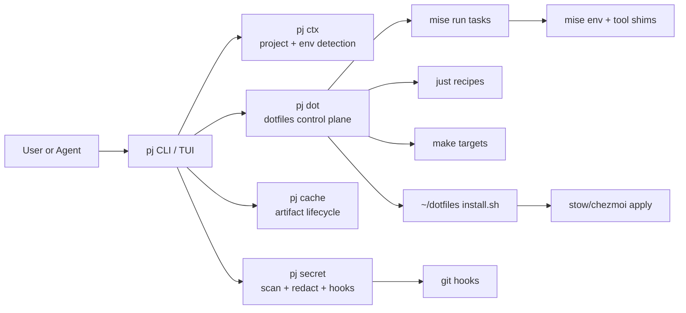
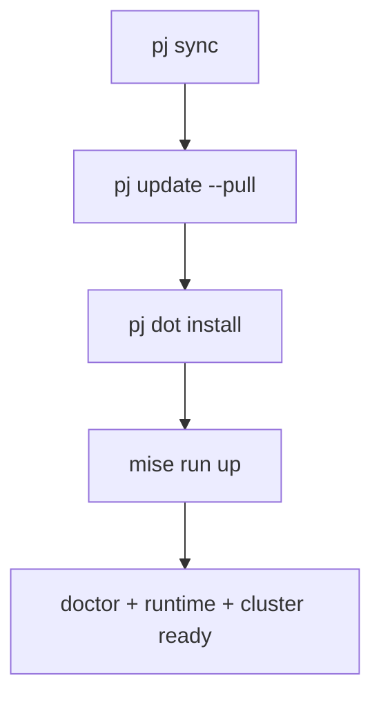
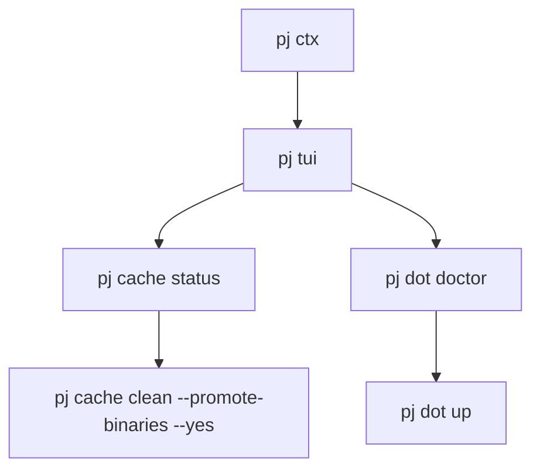
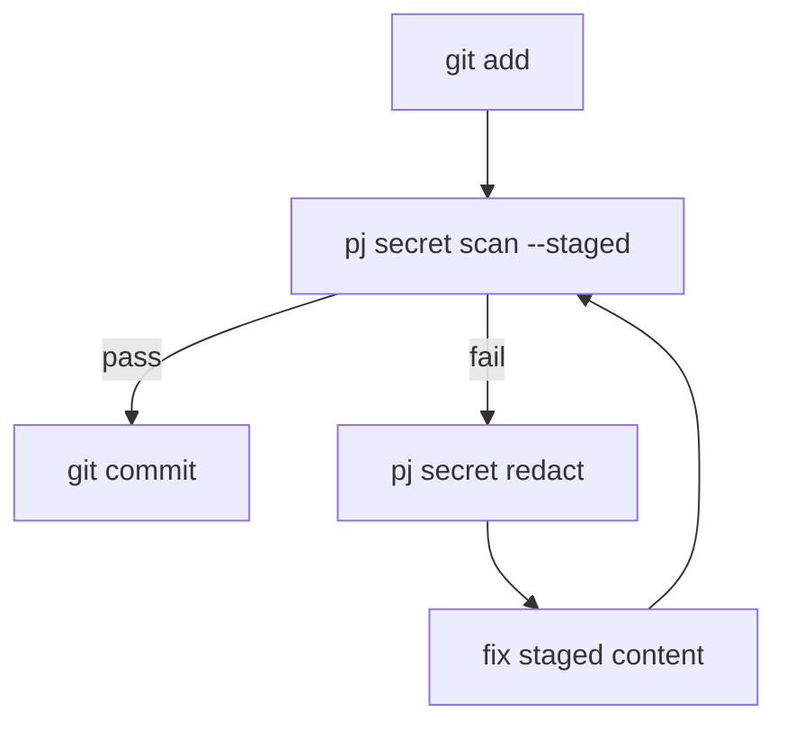

# pj

Portable Rust CLI for bootstrapping, maintaining, and reproducing your dev environment.

## Quick Start

```bash
# from repo
cargo run -- doctor

# install/update local binary
pj install-local
# or
pj update
```

## Core Commands

```bash
pj doctor
pj context
pj ctx                 # alias for context
pj up
pj sync
pj sync --doctor-only
pj tui
```

- `doctor`: checks core tooling (`git`, `gh`, `mise`, `uv`, `bun`, `docker`, `colima`, `kubectl`, `k3d`).
- `context`: project/environment scan (project markers, env file presence, secret-var presence, config state).
- `up`: brings up local stack (dotfiles task if available, otherwise fallback runtime flow).
- `sync`: one-shot update path: `pj update --pull` + `pj dot install` + final dotfiles task (`up` by default, or `doctor` with `--doctor-only`).
- `tui`: ratatui dashboard with maintenance actions.

## Data Flow



## Workflow Patterns

### 1) Full Machine Sync



Use when you want to fully refresh toolchain + dotfiles + local dev runtime.

### 2) Daily Dev Loop



Use when iterating quickly and keeping local resources clean.

### 3) Safe Commit Hygiene



Use to keep secrets out of git history while preserving fast commit flow.

## Install / Update

```bash
pj install-local
pj install-local --source ~/dev/pj
pj update
pj update --pull
```

Behavior:
- Installs to `~/.local/bin/pj`.
- Auto-syncs `~/.cargo/bin/pj` when needed so older PATH precedence does not shadow new features.
- `update --pull` runs `git pull --ff-only` before reinstall.

## Cache / Build Maintenance

```bash
pj cache status
pj cache status --global
pj cache status --global --binaries

pj cache clean --dry-run
pj cache clean --promote-binaries --yes
pj cache clean --all-project --global --yes
```

Default cleanup policy:
- Targets Rust debug build artifacts first (for example `target/debug`, `target/incremental`).

Binary-aware behavior:
- `status --binaries` detects executables in `target/{debug,release}`.
- `clean --promote-binaries` offers to install/update binaries into `~/.local/bin` before cache cleanup.

## Secret Hygiene

```bash
pj secret redact "token=ghp_xxx"
echo "OPENAI_API_KEY=abc" | pj secret redact

pj secret scan --staged
pj secret install-hooks
```

- `redact`: obfsck-style token masking (`[REDACTED-…]`) for common secrets/tokens/URIs.
- `scan --staged`: scans staged diff for likely secrets and exits non-zero on findings.
- `install-hooks`: installs global git hooks to enforce staged secret scanning.

## Dotfiles Control Plane

```bash
pj dot where
pj dot info
pj dot tasks
pj dot install
pj dot adopt
pj dot doctor
pj dot up
```

Includes:
- manager detection (`stow` / `chezmoi`)
- conflict adoption flow with backups (`pj dot adopt`)
- task execution through `mise`/`just`/`make`
- repo helpers (`repo-status`, `repo-diff`, `repo-log`, `pull`, `push`)

## TUI Menu

Current `pj tui` actions include:
- Doctor
- Context
- Cache Status
- Cache + Binaries
- Cache Clean (Dry Run)
- Secret Scan (Staged)
- Install Secret Hooks
- Install Local Binary
- Dot Info
- Dot Tasks
- Dot Doctor
- Dot Up (with in-TUI confirmation)
- Sync Full (with in-TUI confirmation)

Layout:
- Row 1: title/info bar
- Row 2: primary workspace (actions:left, details:right at 1:5 ratio)
- Row 3: single-line vim-style statusline with inline recent event stream

## Versioning / Releases

This repo uses `release-plz` for version bump + changelog + release automation.

Files:
- `.github/workflows/release-plz.yml`
- `release-plz.toml`
- `.github/workflows/release.yml`

Flow:
1. Push to `main` updates/creates a Release PR.
2. Merge Release PR publishes GitHub release/tag.
3. Release workflow builds and uploads binary artifacts.

Local helpers:

```bash
mise run release-pr
mise run release
```

## Mise Tasks

```bash
mise tasks ls
mise run check
mise run build-release
mise run install-local
```

## Roadmap

- Short term:
  - Improve TUI execution previews and long-output paging.
  - Add smarter cache presets per language/toolchain.
  - Expand secret detection patterns and policy tuning.

- Distribution:
  - Keep `pj` off crates.io for now.
  - Continue distribution via local install + GitHub Releases.
  - Revisit crates.io once naming/metadata/release cadence are finalized.
